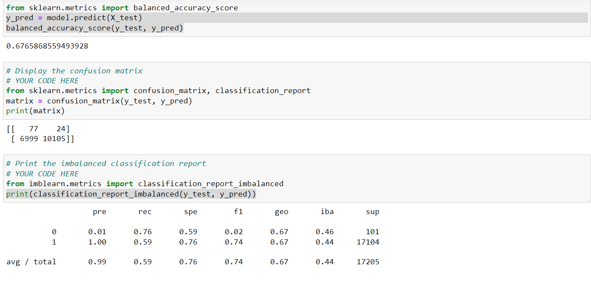
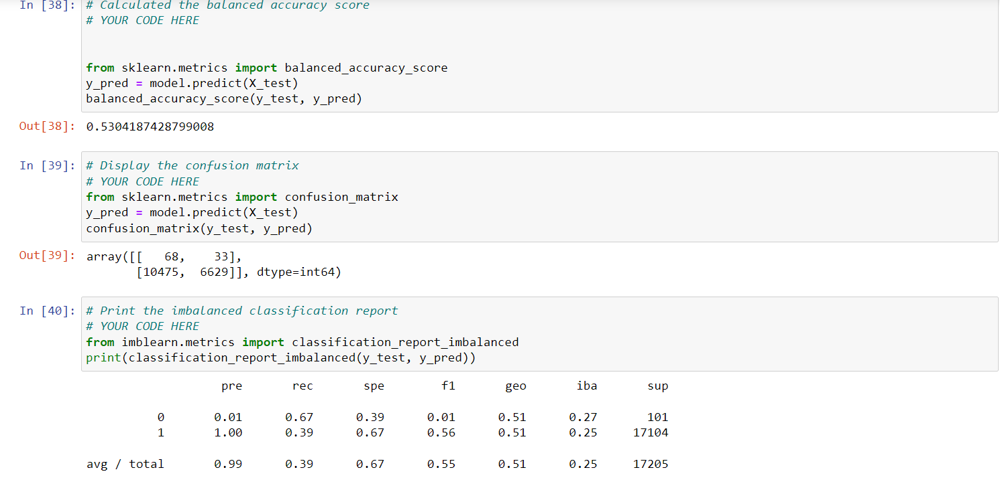
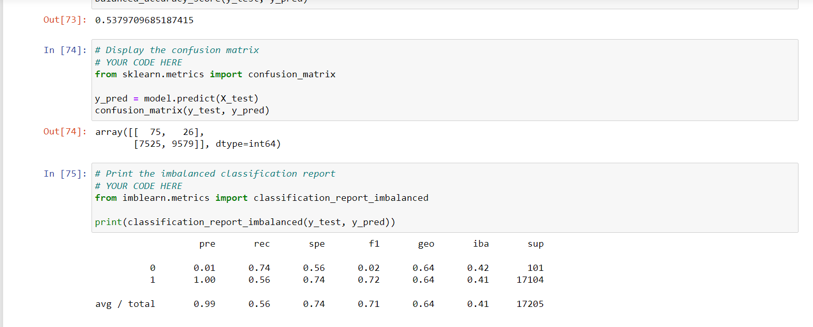
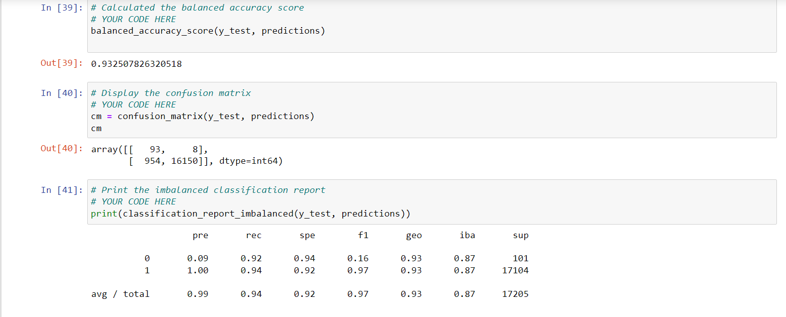

# Credit Risk anlysis
## Overview of the project

Credit risk is an inherently unbalanced classification problem, as good loans easily outnumber risky loans. Therefore, we need to employ different techniques to train and evaluate models with unbalanced classes. Jill asked me to use imbalanced-learn and scikit-learn libraries to build and evaluate models using resampling.

Using the credit card credit dataset from LendingClub, a peer-to-peer lending services company, I’ll oversample the data using the RandomOverSampler and SMOTE algorithms, and undersample the data using the ClusterCentroids algorithm. Then, I’ll use a combinatorial approach of over- and undersampling using the SMOTEENN algorithm. Next, I’ll compare two new machine learning models that reduce bias, BalancedRandomForestClassifier and EasyEnsembleClassifier, to predict credit risk.

Mainly our o bjective is to obtain a good recall (minimize false negatives). In this way we are minimizing the risk of approve high risk credits. 

## Results
### Naive Random Oversampling

This model obtained a 67% of accuracy and a recall of 76% (which is not bad) but its precission is only 1%. I don´t recommend to use it

### SMOTE Oversampling
This model obtained a 53% of accuracy and a recall of 53% and its precission is only 1%. It performs worse than the previous one, I don´t recommend to use it

### Undersampling
This model obtained a 54% of accuracy and a recall of 68% and its precission is only 1%. I don´t recommend to use it

### Combination
This model obtained a 54% of accuracy and a recall of 74% and its precission is only 1%. I don´t recommend to use it

### Random Forest
This model obtained a 69% of accuracy but only 39% of reacall, it has a high precission (93%) but due to its low recall I don´t recommend to use it

### Random Forest
This model obtained a 93% of accuracy (the highest), 92% of reacall (the highest), but has just 9% of precission. I recommend to use this model because is very good avoiding false negatives. 

## Summary

I recommend to use Adaboost because is very good avoiding false negatives, it has the highest accuracy and the highest recall. I suggest to implement anothe process to analyze the credits that are predicted as high risk (interviews, etc), because 91% of them are in reality low risk
